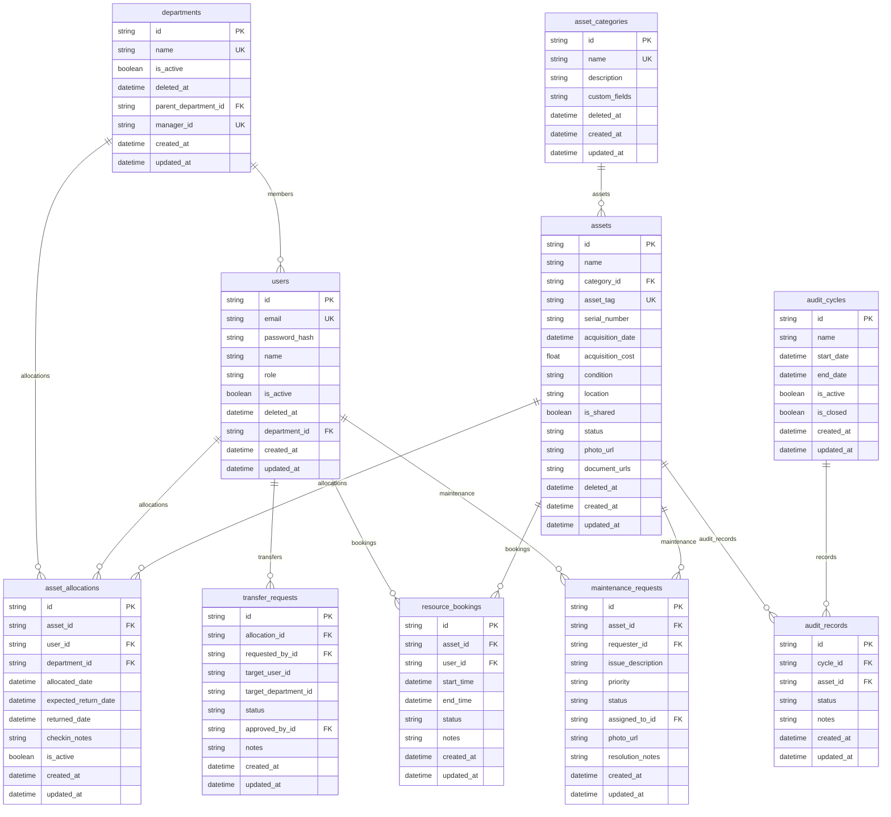

# Database Schema Documentation

This document lists the tables, data types, relationships, and index keys configured in the **AssetFlow** database.

---

## 🗺️ Entity-Relationship Diagram

---

## 🗃️ Database Tables Definition

### 1. `users` Table
Tracks registered employees, roles, and department affiliations.
* **Indexes**: 
  - Index on `email` (for quick login/verification)
  - Index on `department_id`

### 2. `departments` Table
Tracks operational divisions and hierarchy lines.
* **Indexes**:
  - Index on `parent_department_id`

### 3. `asset_categories` Table
Stores structural rules and default custom specifications per category.

### 4. `assets` Table
Master inventory log of physical and bookable assets.
* **Indexes**:
  - Index on `category_id`
  - Index on `status` (Available, Allocated, etc.)
  - Index on `asset_tag` (AF-XXXX)

### 5. `asset_allocations` Table
Tracks active ownership checkouts.
* **Indexes**:
  - Index on `asset_id`
  - Index on `user_id`
  - Index on `department_id`
  - Index on `is_active`

### 6. `transfer_requests` Table
Tracks handovers.
* **Indexes**:
  - Index on `allocation_id`
  - Index on `requested_by_id`
  - Index on `status`

### 7. `resource_bookings` Table
Schedules shared space reservations.
* **Indexes**:
  - Index on `asset_id`
  - Index on `user_id`
  - Compound Index on `[start_time, end_time]` (for collision verification queries)

### 8. `maintenance_requests` Table
Repairs pipeline logs.
* **Indexes**:
  - Index on `asset_id`
  - Index on `requester_id`
  - Index on `status`

### 9. `audit_cycles` Table
Checks inventory.

### 10. `audit_records` Table
Auditor checklist items.
* **Indexes**:
  - Index on `cycle_id`
  - Index on `asset_id`
